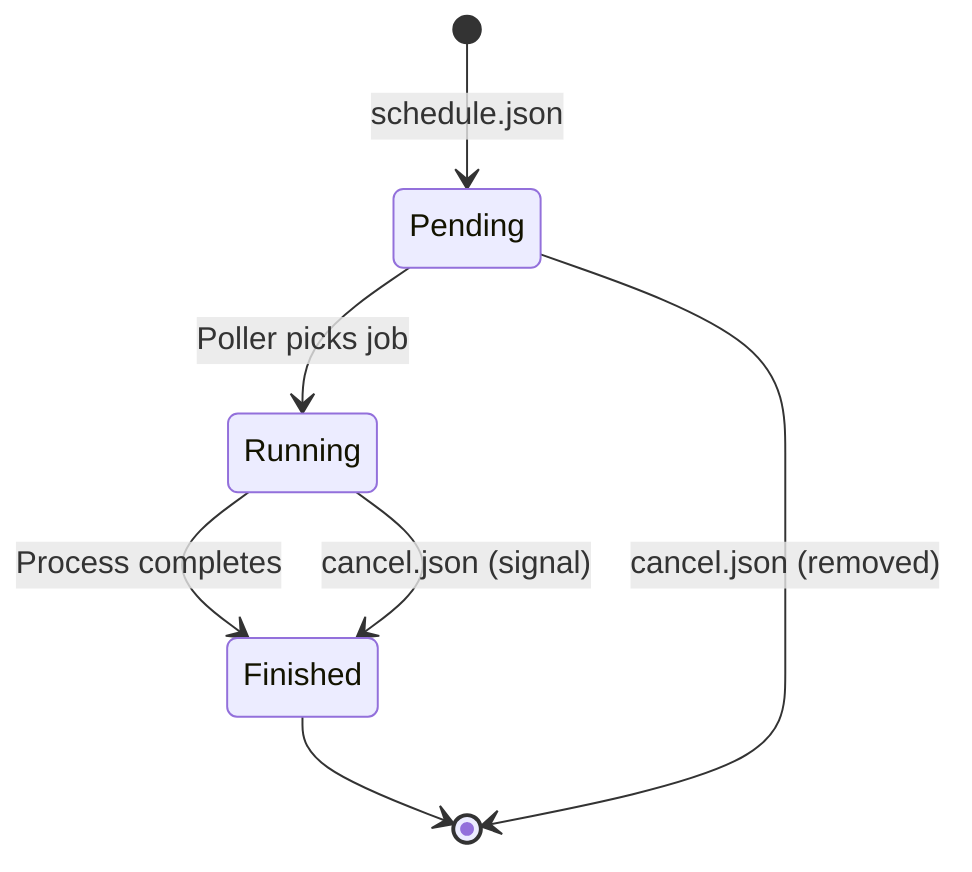

Scrapyd manages spider jobs through a sophisticated scheduling system that handles priority queues, concurrent execution, and job lifecycle tracking.

## Job Lifecycle

Every spider job in Scrapyd transitions through three states:



### Pending

When you schedule a spider, it's added to a **priority queue** for that project:

```python scheduler.py:13-14
def schedule(self, project, spider_name, priority=0.0, **spider_args):
    self.queues[project].add(spider_name, priority=priority, **spider_args)
```

Pending jobs are stored in SQLite with their priority:

```python sqlite.py:69-74
def put(self, message, priority=0.0):
    self.conn.execute(
        f"INSERT INTO {self.table} (priority, message) VALUES (?, ?)",
        (priority, self.encode(message)),
    )
    self.conn.commit()
```

You can view pending jobs:

```bash
curl http://localhost:6800/listjobs.json?project=myproject
```

```json
{
  "pending": [
    {
      "id": "abc123",
      "project": "myproject",
      "spider": "quotes",
      "version": "1.0",
      "settings": {},
      "args": {}
    }
  ]
}
```

### Running

The **Poller** checks queues periodically (default: every 5 seconds) and dispatches jobs when process slots are available:

```python poller.py:15-28
@inlineCallbacks
def poll(self):
    for project, queue in self.queues.items():
        while (yield maybeDeferred(queue.count)):
            # If the "waiting" backlog is empty (max processes running):
            if not self.dq.waiting:
                return
            message = (yield maybeDeferred(queue.pop)).copy()
            if message is not None:
                message["_project"] = project
                message["_spider"] = message.pop("name")
                # Pop a dummy item from the "waiting" backlog
                self.dq.put(message)
```

When a slot becomes available, the **Launcher** spawns the process:

```python launcher.py:57-76
def _spawn_process(self, message, slot):
    project = message["_project"]
    environment = self.app.getComponent(IEnvironment)
    message.setdefault("settings", {})
    message["settings"].update(environment.get_settings(message))

    env = environment.get_environment(message, slot)
    args = [sys.executable, "-m", self.runner, "crawl", *get_crawl_args(message)]

    process = ScrapyProcessProtocol(project, message["_spider"], message["_job"], env, args)
    process.deferred.addBoth(self._process_finished, slot)

    try:
        reactor.spawnProcess(process, sys.executable, args=args, env=env)
    except OSError as e:
        raise LauncherError(f"{e}: args={args!r}") from e

    self.processes[slot] = process
    log.debug("Process slot {slot} occupied", slot=slot)
```

### Finished

When a process completes, it's moved to **finished jobs** storage:

```python launcher.py:77-83
def _process_finished(self, _, slot):
    process = self.processes.pop(slot)
    process.end_time = datetime.datetime.now()
    self.finished.add(process)
    log.debug("Process slot {slot} vacated", slot=slot)

    self._get_message(slot)  # Ready for next job
```

Finished jobs are kept in memory (or SQLite) for inspection:

```python jobstorage.py:19-21
def add(self, job):
    self.jobs.append(job)
    del self.jobs[: -self.finished_to_keep]  # keep last x finished jobs
```

By default, the last **100 finished jobs** are retained (configurable via `finished_to_keep`).

## Priority Queues

Scrapyd uses priority queues to determine job execution order. Jobs with **higher priority** run first.

### Setting Priority

Specify priority when scheduling (default is `0.0`):

```bash
# Low priority
curl http://localhost:6800/schedule.json \
  -d project=myproject \
  -d spider=background_scraper \
  -d priority=-1.0

# Normal priority (default)
curl http://localhost:6800/schedule.json \
  -d project=myproject \
  -d spider=regular_scraper

# High priority
curl http://localhost:6800/schedule.json \
  -d project=myproject \
  -d spider=urgent_scraper \
  -d priority=10.0
```

### Queue Implementation

The `SqliteSpiderQueue` uses SQLite's ordering to implement priority:

```python sqlite.py:76-88
def pop(self):
    row = self.conn.execute(
        f"SELECT id, message FROM {self.table} ORDER BY priority DESC LIMIT 1"
    ).fetchone()
    if row is None:
        return None
    _id, message = row

    # If a row vanished, try again
    if not self.conn.execute(f"DELETE FROM {self.table} WHERE id = ?", (_id,)).rowcount:
        self.conn.rollback()
        return self.pop()

    self.conn.commit()
    return self.decode(message)
```

Jobs are selected with `ORDER BY priority DESC`, so higher numbers run first.

<Info>
**Priority ranges**: While any float value works, common practice is:
- **-10 to -1**: Low priority (background jobs)
- **0**: Normal priority (default)
- **1 to 10**: High priority (urgent jobs)
</Info>

## Concurrent Execution

Scrapyd runs multiple spider processes in parallel, controlled by the **max_proc** setting.

### Process Slots

The launcher maintains a pool of process slots:

```python launcher.py:41-50
def startService(self):
    log.info(
        "Scrapyd {version} started: max_proc={max_proc!r}, runner={runner!r}",
        version=__version__,
        max_proc=self.max_proc,
        runner=self.runner,
        log_system="Launcher",
    )
    for slot in range(self.max_proc):
        self._get_message(slot)
```

Each slot can hold one running process. When a slot is free, the launcher requests the next job from the poller.

### Default Concurrency

By default, `max_proc` is calculated as:

```python
max_proc = cpu_count() * max_proc_per_cpu
```

Where:
- `cpu_count()`: Number of CPU cores
- `max_proc_per_cpu`: Default is **4**

For example, on a 4-core machine:
```
max_proc = 4 × 4 = 16 concurrent processes
```

### Configuring Concurrency

Override in your configuration file:

```ini
[scrapyd]
# Set explicit limit
max_proc = 8

# Or adjust per-CPU multiplier
max_proc_per_cpu = 2
```

Or via environment variables:

```bash
export SCRAPYD_MAX_PROC=8
scrapyd
```

<Warning>
**Resource consideration**: Each spider process consumes memory and CPU. Don't set `max_proc` too high or you may exhaust system resources.
</Warning>

## Scheduling Jobs

Schedule a spider via the HTTP API:

```bash
curl http://localhost:6800/schedule.json \
  -d project=myproject \
  -d spider=quotes \
  -d priority=5.0 \
  -d setting=DOWNLOAD_DELAY=2 \
  -d custom_arg=value
```

The request is processed by the Schedule endpoint:

```python webservice.py:199-230
@param("project")
@param("spider")
@param("_version", dest="version", required=False, default=None)
@param("jobid", required=False, default=lambda: uuid.uuid1().hex)
@param("priority", required=False, default=0, type=float)
@param("setting", required=False, default=list, multiple=True)
def render_POST(self, txrequest, project, spider, version, jobid, priority, setting):
    if project not in self.root.poller.queues:
        raise error.Error(code=http.OK, message=b"project '%b' not found" % project.encode())

    if version and self.root.eggstorage.get(project, version) == (None, None):
        raise error.Error(code=http.OK, message=b"version '%b' not found" % version.encode())

    spiders = spider_list.get(project, version, runner=self.root.runner)
    if spider not in spiders:
        raise error.Error(code=http.OK, message=b"spider '%b' not found" % spider.encode())

    args = {key.decode(): values[0].decode() for key, values in txrequest.args.items()}
    if version is not None:
        args["_version"] = version

    self.root.scheduler.schedule(
        project,
        spider,
        priority=priority,
        settings=dict(s.split("=", 1) for s in setting),
        _job=jobid,
        **args,
    )

    return {"jobid": jobid}
```

### Job ID

Every job gets a unique ID:

- **Auto-generated**: UUID (default) - `abc123def456789`
- **Custom**: Specify `jobid` parameter

```bash
# Auto-generated ID
curl http://localhost:6800/schedule.json \
  -d project=myproject \
  -d spider=quotes

# Custom ID
curl http://localhost:6800/schedule.json \
  -d project=myproject \
  -d spider=quotes \
  -d jobid=daily-quotes-2024-03-05
```

<Tip>
Custom job IDs are useful for:
- Idempotent scheduling (prevent duplicate jobs)
- Tracking jobs across systems
- Organizing logs and items by meaningful names
</Tip>

## Canceling Jobs

Cancel pending or running jobs:

```bash
curl http://localhost:6800/cancel.json \
  -d project=myproject \
  -d job=abc123
```

The cancel operation handles both states:

```python webservice.py:244-268
def render_POST(self, txrequest, project, job, signal):
    if project not in self.root.poller.queues:
        raise error.Error(code=http.OK, message=b"project '%b' not found" % project.encode())

    prevstate = None

    # Remove from queue if pending
    if self.root.poller.queues[project].remove(lambda message: message["_job"] == job):
        prevstate = "pending"

    if signal.isdigit():
        signal = int(signal)

    # Signal process if running
    for process in self.root.launcher.processes.values():
        if process.project == project and process.job == job:
            process.transport.signalProcess(signal)
            prevstate = "running"

    log.debug(
        "Job canceled: project={project!r} job={job!r} prevstate={prevstate!r}",
        project=project,
        job=job,
        prevstate=prevstate,
    )

    return {"prevstate": prevstate}
```

- **Pending jobs**: Removed from the queue immediately
- **Running jobs**: Sent a signal (default: `SIGINT` on Unix, `SIGBREAK` on Windows)

<Note>
Canceling a running job sends a signal to the process. The spider should handle graceful shutdown. If the spider doesn't respond, you may need to use `SIGKILL` (signal 9):

```bash
curl http://localhost:6800/cancel.json \
  -d project=myproject \
  -d job=abc123 \
  -d signal=9
```
</Note>

## Checking Job Status

Check the current state of a job:

```bash
curl http://localhost:6800/status.json?job=abc123
```

```json
{
  "status": "ok",
  "currstate": "running",
  "node_name": "node-1"
}
```

Possible states:
- `"pending"`: In queue, waiting to run
- `"running"`: Currently executing
- `"finished"`: Completed
- `null`: Job not found

The status check searches all three states:

```python webservice.py:324-347
def render_GET(self, txrequest, job, project):
    queues = self.root.poller.queues
    if project is not None and project not in queues:
        raise error.Error(code=http.OK, message=b"project '%b' not found" % project.encode())

    result = {"currstate": None}

    # Check finished
    for finished in self.root.launcher.finished:
        if (project is None or finished.project == project) and finished.job == job:
            result["currstate"] = "finished"
            return result

    # Check running
    for process in self.root.launcher.processes.values():
        if (project is None or process.project == project) and process.job == job:
            result["currstate"] = "running"
            return result

    # Check pending
    for queue_name in queues if project is None else [project]:
        for message in queues[queue_name].list():
            if message["_job"] == job:
                result["currstate"] = "pending"
                return result

    return result
```

## Monitoring Jobs

List all jobs for a project:

```bash
curl http://localhost:6800/listjobs.json?project=myproject
```

```json
{
  "status": "ok",
  "pending": [
    {
      "id": "abc123",
      "project": "myproject",
      "spider": "quotes",
      "version": "1.0",
      "settings": {"DOWNLOAD_DELAY": "2"},
      "args": {"category": "books"}
    }
  ],
  "running": [
    {
      "id": "def456",
      "project": "myproject",
      "spider": "articles",
      "pid": 12345,
      "start_time": "2024-03-05 10:30:15.123456",
      "log_url": "/logs/myproject/articles/def456.log",
      "items_url": "/items/myproject/articles/def456.jl"
    }
  ],
  "finished": [
    {
      "id": "ghi789",
      "project": "myproject",
      "spider": "products",
      "start_time": "2024-03-05 09:00:00.000000",
      "end_time": "2024-03-05 09:15:30.000000",
      "log_url": "/logs/myproject/products/ghi789.log",
      "items_url": "/items/myproject/products/ghi789.jl"
    }
  ],
  "node_name": "node-1"
}
```

Or check overall daemon status:

```bash
curl http://localhost:6800/daemonstatus.json
```

```json
{
  "status": "ok",
  "pending": 3,
  "running": 8,
  "finished": 42,
  "node_name": "node-1"
}
```

## Best Practices

<AccordionGroup>
  <Accordion title="Use priorities for job importance">
    Assign priorities based on business requirements:
    
    ```python
    # Critical real-time scraper
    priority = 10.0
    
    # Regular scheduled job
    priority = 0.0
    
    # Background data refresh
    priority = -5.0
    ```
  </Accordion>
  
  <Accordion title="Set appropriate max_proc">
    Consider your hardware and job characteristics:
    
    ```ini
    [scrapyd]
    # I/O-bound jobs (lots of network waits) - higher concurrency
    max_proc = 32
    
    # CPU-bound jobs (heavy processing) - match CPU cores
    max_proc = 8
    
    # Memory-intensive jobs - conservative limit
    max_proc = 4
    ```
  </Accordion>
  
  <Accordion title="Use meaningful job IDs for tracking">
    Custom job IDs make debugging and monitoring easier:
    
    ```bash
    # Include timestamp and spider name
    jobid="quotes-$(date +%Y%m%d-%H%M%S)"
    
    curl http://localhost:6800/schedule.json \
      -d project=myproject \
      -d spider=quotes \
      -d jobid=$jobid
    ```
  </Accordion>
  
  <Accordion title="Monitor finished job retention">
    Adjust `finished_to_keep` based on monitoring needs:
    
    ```ini
    [scrapyd]
    # Keep more history for debugging
    finished_to_keep = 500
    
    # Or use SQLite for persistence
    jobstorage = scrapyd.jobstorage.SqliteJobStorage
    ```
  </Accordion>
</AccordionGroup>

## Advanced: Custom Queue Implementation

You can implement custom queue backends (e.g., Redis) by implementing `ISpiderQueue`:

```python
from zope.interface import implementer
from scrapyd.interfaces import ISpiderQueue
import redis
import json

@implementer(ISpiderQueue)
class RedisSpiderQueue:
    def __init__(self, config, project):
        self.project = project
        self.redis = redis.Redis()
        self.key = f"scrapyd:queue:{project}"
    
    def add(self, name, priority=0.0, **spider_args):
        message = {"name": name, **spider_args}
        # Use sorted set with priority as score
        self.redis.zadd(self.key, {json.dumps(message): priority})
    
    def pop(self):
        # Get highest priority (max score)
        items = self.redis.zpopmax(self.key)
        if items:
            message_json, priority = items[0]
            return json.loads(message_json)
        return None
    
    def count(self):
        return self.redis.zcard(self.key)
    
    def list(self):
        items = self.redis.zrange(self.key, 0, -1, withscores=True)
        return [json.loads(msg) for msg, score in items]
    
    def remove(self, func):
        # Implementation details...
        pass
    
    def clear(self):
        self.redis.delete(self.key)
```

This allows multiple Scrapyd instances to share a queue.

## Next Steps

<CardGroup cols={2}>
  <Card title="Running Spiders" icon="play" href="/operations/running-spiders">
    Learn how to schedule and manage spider runs
  </Card>
  <Card title="Job Management" icon="tasks" href="/operations/job-management">
    Advanced job management techniques
  </Card>
  <Card title="Schedule API" icon="code" href="/api/schedule">
    API reference for scheduling jobs
  </Card>
  <Card title="Monitoring" icon="chart-line" href="/operations/monitoring">
    Monitor job execution and performance
  </Card>
</CardGroup>
