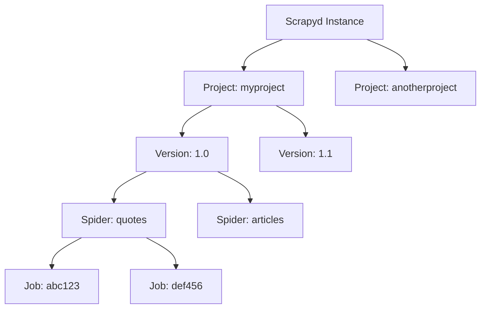

Scrapyd is a service daemon for running Scrapy spiders. It provides an HTTP API for deploying projects and scheduling crawls, managing multiple concurrent spider processes.

## Architecture Overview

Scrapyd is built on the [Twisted Application Framework](https://docs.twisted.org/en/stable/core/howto/application.html), which provides the foundation for its asynchronous, event-driven architecture.

### Core Components

When Scrapyd starts, it initializes several key components that work together:

<CodeGroup>
```python app.py:18-35
def application(config):
    app = Application("Scrapyd")
    bind_address = os.getenv("SCRAPYD_BIND_ADDRESS") or config.get("bind_address", "127.0.0.1")
    http_port = int(os.getenv("SCRAPYD_HTTP_PORT") or config.getint("http_port", "6800"))
    unix_socket_path = os.getenv("SCRAPYD_UNIX_SOCKET_PATH") or config.get("unix_socket_path", "")
    poll_interval = config.getfloat("poll_interval", 5)

    environment = Environment(config)
    scheduler = SpiderScheduler(config)
    poller = initialize_component(config, "poller", "scrapyd.poller.QueuePoller")
    jobstorage = initialize_component(config, "jobstorage", "scrapyd.jobstorage.MemoryJobStorage")
    eggstorage = initialize_component(config, "eggstorage", "scrapyd.eggstorage.FilesystemEggStorage")

    app.setComponent(IEnvironment, environment)
    app.setComponent(ISpiderScheduler, scheduler)
    app.setComponent(IPoller, poller)
    app.setComponent(IJobStorage, jobstorage)
    app.setComponent(IEggStorage, eggstorage)
```
</CodeGroup>

#### Scheduler

The **SpiderScheduler** accepts new job requests and adds them to the appropriate project's queue:

```python scheduler.py:13-14
def schedule(self, project, spider_name, priority=0.0, **spider_args):
    self.queues[project].add(spider_name, priority=priority, **spider_args)
```

#### Poller

The **QueuePoller** periodically checks project queues for pending jobs and dispatches them when capacity is available. It runs on a timer (default: every 5 seconds):

```python app.py:40
timer = TimerService(poll_interval, poller.poll)
```

#### Launcher

The **Launcher** manages the actual spider processes. It maintains a pool of process slots and spawns new Scrapy processes:

```python launcher.py:85-94
def _get_max_proc(self, config):
    max_proc = config.getint("max_proc", 0)
    if max_proc:
        return max_proc

    try:
        cpus = multiprocessing.cpu_count()
    except NotImplementedError:
        cpus = 1
    return cpus * config.getint("max_proc_per_cpu", 4)
```

By default, Scrapyd calculates `max_proc` as **CPU count × 4**, allowing significant parallelism.

#### Egg Storage

The **EggStorage** component stores project versions as Python egg files on the filesystem:

```python eggstorage.py:22-24
def __init__(self, config):
    self.basedir = config.get("eggs_dir", "eggs")
```

#### Job Storage

The **JobStorage** keeps track of finished jobs. It can use in-memory storage or SQLite:

```python jobstorage.py:14-17
def __init__(self, config):
    self.jobs = []
    self.finished_to_keep = config.getint("finished_to_keep", 100)
```

### Request Flow

Here's how a typical spider execution flows through Scrapyd:

<Steps>
  <Step title="Schedule Request">
    API request arrives at `/schedule.json` endpoint with project, spider, and optional parameters.
  </Step>
  
  <Step title="Queue Job">
    Scheduler adds the job to the project's priority queue with specified priority (default: 0.0).
  </Step>
  
  <Step title="Poll">
    Poller checks queues on timer interval and retrieves next job if process slots are available.
  </Step>
  
  <Step title="Spawn Process">
    Launcher spawns a new process running:
    ```bash
    python -m scrapyd.runner crawl <spider_name> [args...]
    ```
  </Step>
  
  <Step title="Execute">
    Runner activates the project's egg file and calls Scrapy's command line:
    ```python runner.py:67-73
    from scrapy.cmdline import execute
    execute()
    ```
  </Step>
  
  <Step title="Complete">
    When the process finishes, the launcher records it in job storage and frees the process slot.
  </Step>
</Steps>

## Hierarchy: Projects → Versions → Spiders → Jobs

Scrapyd organizes work in a clear hierarchy:



### Projects

A **project** is a Scrapy application containing one or more spiders. Each project is deployed as a versioned egg file.

### Versions

Each project can have multiple **versions**. When you schedule a spider, Scrapyd uses the latest version by default, unless you specify a version explicitly:

```bash
# Uses latest version
curl http://localhost:6800/schedule.json -d project=myproject -d spider=quotes

# Uses specific version
curl http://localhost:6800/schedule.json -d project=myproject -d spider=quotes -d _version=1.0
```

See [Projects & Versions](/concepts/projects-versions) for details on version ordering.

### Spiders

Each version contains one or more **spiders** (Scrapy crawlers). You must specify which spider to run when scheduling.

### Jobs

A **job** is a single execution of a spider. Each job gets a unique ID (UUID by default) and transitions through states: pending → running → finished.

See [Jobs & Scheduling](/concepts/jobs-scheduling) for the complete lifecycle.

## Web Interface

Scrapyd includes a minimal web UI at `http://localhost:6800/` for monitoring:

- **Jobs page** (`/jobs`) - View pending, running, and finished jobs
- **Logs directory** (`/logs/`) - Access log files
- **Items directory** (`/items/`) - Download scraped items (if configured)

<Info>
The web UI is for monitoring only. Use the [HTTP API](/api/overview) to deploy projects and schedule spiders.
</Info>

## Configuration

Every component in Scrapyd is configurable through the configuration file. You can replace implementations of any interface:

```ini
[scrapyd]
launcher = myproject.custom.Launcher
eggstorage = myproject.S3EggStorage
poller = myproject.RedisPoller
```

See the [Configuration](/configuration/overview) section for all available settings.

## Process Execution

When Scrapyd spawns a spider process, it essentially runs:

```bash
python -m scrapyd.runner crawl myspider -s LOG_FILE=/path/to/log -a arg1=value1
```

The runner:

1. Reads the `SCRAPY_PROJECT` environment variable
2. Retrieves the egg from storage (using `SCRAPYD_EGG_VERSION` if specified)
3. Activates the egg to make the project importable
4. Calls Scrapy's `execute()` function with the provided arguments

This design keeps spider processes completely isolated from the Scrapyd daemon.

## Next Steps

<CardGroup cols={2}>
  <Card title="Projects & Versions" icon="folder" href="/concepts/projects-versions">
    Learn how to manage project versions and egg storage
  </Card>
  <Card title="Jobs & Scheduling" icon="clock" href="/concepts/jobs-scheduling">
    Understand job lifecycle and priority queues
  </Card>
  <Card title="HTTP API" icon="code" href="/api/overview">
    Explore the complete API reference
  </Card>
  <Card title="Configuration" icon="gear" href="/configuration/overview">
    Customize Scrapyd's behavior
  </Card>
</CardGroup>
